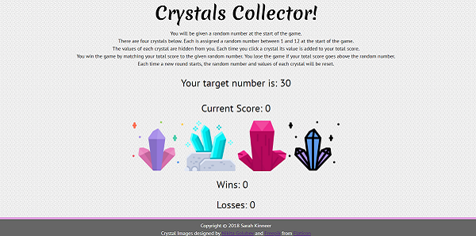

# Crystal Collector Game
Interactive web browser game with HTML dynamically updated using jQuery

## Developed by: Sarah Kinneer
## December, 2018

## The Problem:
Given a description of the game's format, code a game for students to use to practice basic math and mental computation practice.

## The Solution:
I created the game according to the specifications.  I tested the game out with my seventh grade students, who enjoyed playing it so much during math that they asked to play again during their break time.

## Technical Approach:
The page was built using HTML5 and CSS3 for a stylish look.  The JavaScript logic features jQuery to dynamically update the page.

## Link to Live Site:
- [Play the Game!](https://kinneers.github.io/crystal-collector-game/) - Head to the live site for some fun!

## To Use the Live Site:
- You will be given a random target number between 19 and 120 at the beginning of the game.
- The object of the game is to hit the target number exactly by clicking or tapping on a series of 4 crystals.
- Each crystal is worth a number of points between 1 and 12, chosen randomly.
- You will not know how much a crystal is worth until it is clicked/tapped and it increments your current score by its value.
- If you are able to hit the target number, you will be awarded a win and another round will begin.
- If you are unable to hit the target number, you will gain a loss and another round will begin.

## Photograph and Sound Sources:
Many thanks to Nikita Golubev and Freepik on Flaticon for crystal images!
Thank you to Alex Nolla from Subtle Patterns for the background pattern!
